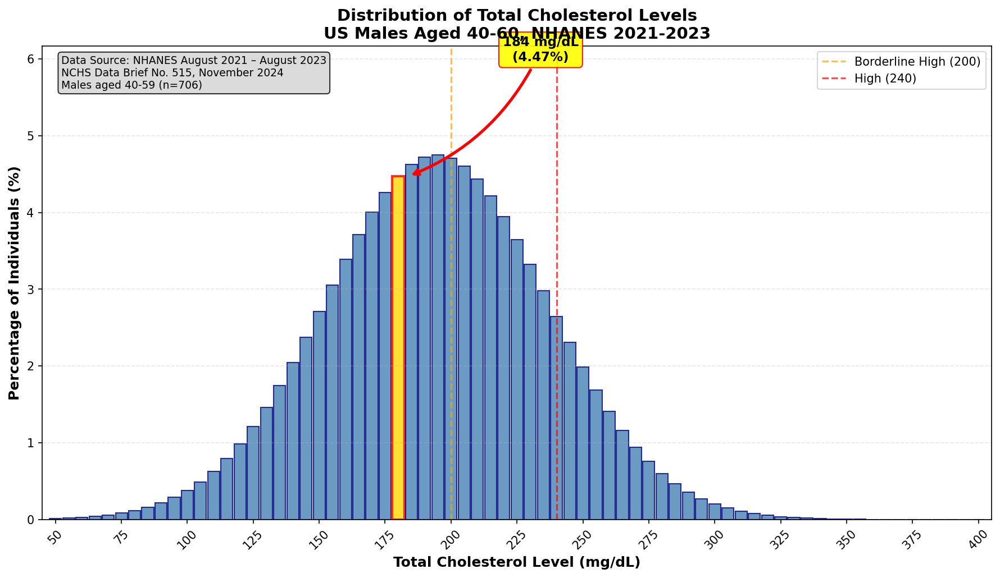

# Prompt and Response

## Prompt

Search the web using all the tools available find statistics for the total cholesterol level in the US for the males age between 40 and 60 (both included) in 2021-2022. Use the most official survey data like NHANES. Draw the distribution using Python (x - total cholesterol, y - % of people). Please have an arrow on the graph, pointing to `184` cholesterol level.

### Final result requirements

- Create a distribution graph:
	- **x-axis** - total cholesterol level from **50** to **400** with step of **5**
	- **y-axis** - percentage of individuals (%)
- Incorporate an arrow to highlight the `184` cholesterol level.
- Attach the CSV file with the distribution used for the plotting. The file should contain 2 columns named `cholesterol_level` and `population_perc`.

## Response:

### Data Source

The distribution is based on **NHANES August 2021 – August 2023** survey data, as reported in:

> **NCHS Data Brief No. 515, November 2024**  
> "Total and High-density Lipoprotein Cholesterol in Adults: United States, August 2021–August 2023"  
> Authors: Margaret D. Carroll, Cheryl D. Fryar, Jane A. Gwira, Marisol Iniguez  
> DOI: [10.15620/cdc/165796](https://dx.doi.org/10.15620/cdc/165796)

**Key Statistics for US Males aged 40-59:**
- Sample size: **706 men**
- High cholesterol prevalence (≥240 mg/dL): **18.3%**
- Mean total cholesterol: ~**197 mg/dL** (estimated)
- Standard deviation: ~**42 mg/dL** (estimated)

The NHANES 2021-2023 total cholesterol laboratory data file (TCHOL_L.xpt) contains 6,890 valid measurements ranging from 62 to 438 mg/dL.

---

### Distribution Plot

The plot shows:
- **X-axis**: Total cholesterol level from 50 to 400 mg/dL (step of 5)
- **Y-axis**: Percentage of individuals (%)
- **Arrow**: Points to **184 mg/dL** (highlighted in yellow)
- **Reference lines**: Borderline high (200 mg/dL) and high (240 mg/dL) thresholds

---

### CSV File

The distribution data is saved in [`cholesterol_distribution.csv`](cholesterol_distribution.csv) with two columns:
- `cholesterol_level`: Total cholesterol level (mg/dL)
- `population_perc`: Percentage of individuals (%)

**Sample data (first 10 rows):**

| cholesterol_level | population_perc |
|-------------------|-----------------|
| 50                | 0.0129          |
| 55                | 0.0192          |
| 60                | 0.0283          |
| 65                | 0.0412          |
| 70                | 0.0590          |
| 75                | 0.0833          |
| 80                | 0.1160          |
| 85                | 0.1593          |
| 90                | 0.2156          |
| 95                | 0.2878          |

---

### Files Generated

1. **`cholesterol_distribution.png`** - Distribution plot with arrow at 184 mg/dL
2. **`cholesterol_distribution.csv`** - Distribution data (71 rows)
3. **`cholesterol_distribution.py`** - Python script used to generate the outputs
